##  기획서 [링크](https://www.notion.so/ad600e4a8d144113aa268551966bb6d3?pvs=4)

## #1 what

- webRTC를 통한 퍼스널 뷰티 컨설팅 서비스

  : 전문 뷰티 상담사가 AI와 설문 분석 결과를 통해 얼굴형과 피부 타입에 가장 적합한 화장품과 화장법, 헤어스타일링을 판별한다. 이로써 가장 돋보이는 스타일을 찾아 해당 사용자만의 퍼스널 뷰티를 해결하는 데 도움을 주는 컨설팅. 사용자는 자신만의 퍼스널 화장품 및 메이크업 문의에 대한 실시간으로 즉각적인 답변을 얻을 수 있음.

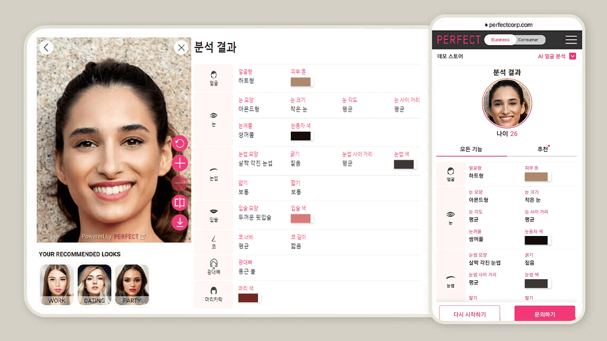
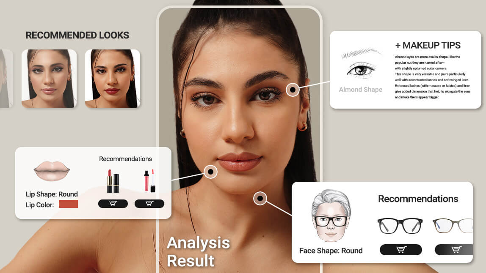

## 참고

1) 에스쁘아 홈페이지 > 이벤트 > 온라인 메이크업 컨설팅

https://www.espoir.com/ko/service/service_beauty_user.do

2) 셜록뷰티 퍼스널 정밀 컨설팅 시스템

https://slbt.imweb.me/

## #2 why

**▶ 트렌드 - AI 전문성**

Z세대는 지나치게 많은 정보와 의견으로부터 진위를 식별하는데 어려움을 겪고 있습니다. 그럼에도 불구하고 Z세대 소비자들은 브랜드를 전문가로 보지 않는 경항이 있어 브랜드에서는 소비자에게 신뢰감을 주기 위해 ‘제 3의 전문 소스’에 투자하여 이를 판매 및 마케팅에 반영할 필요가 있습니다.
이에 뷰티업계에서는 AI를 도구를 활용하여 소비자가 필요로 하는 답을 제공하기 위한 방법이 시도되고 있다.

화장품을 구입할 때 사용 후기는 하나부터 열까지 꼼꼼하게 따지면서, 정작 그 제품이 내게 진짜 필요한 지 구분조차 하지 못하고 감에 의존한 채 무작정 수비하고 있지 않은 지. 그러나 언뜻 비슷해 보이는 피부일지라도 자세히 살펴보면 각기 다른 솔루션을 필요로 하는 경우가 많습니다. 이에 더해 누구나 화상으로 쉽게 접할 수 있는 접근성이 좋은 점도 큰 강점이 될 수 있습니다.

https://www.i-boss.co.kr/ab-74668-3259

## #3 how

### 1. 퍼스널 뷰티 컨설팅 (피부타입, 메이크업, 헤어 스타일링)

- 개인별 피부타입, 얼굴형 등에 맞는 헤어스타일, 화장법 등을 추천
- 사전 피부타입 진단 설문 -> AI 카메라 테스트 -> 전문가와 화상으로 진행 → 컨설팅 최종 결과 보고서

**1) 피부 타입 총 16가지의 피부 유형이 나오는 약 60문항의 피부 MBTI 진단 테스트**
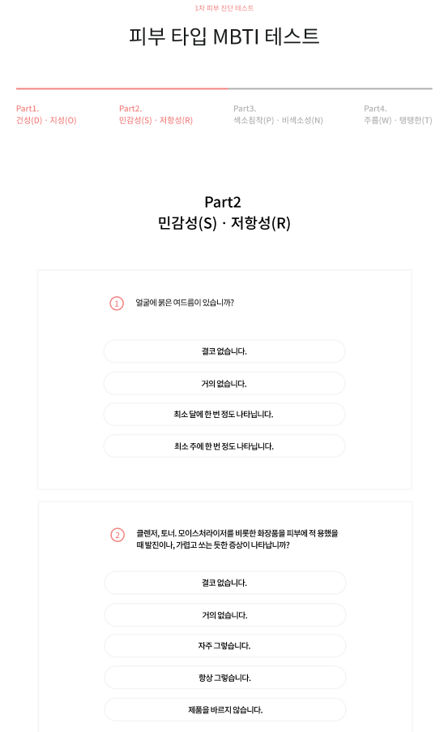

→ 1차 피부 타입 결과지
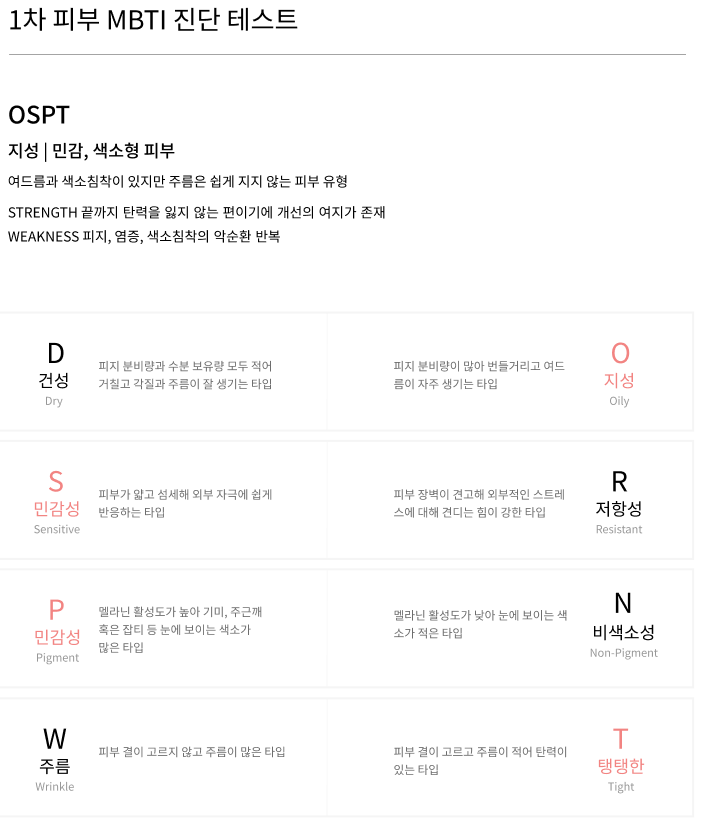

**2) AI 카메라로 자신의 얼굴 촬영 후 피부, 이목구비, 얼굴형 분석**

→ 2차 AI 카메라 촬영 결과지

**3) 뷰티 전문가를 통한 화상 컨설팅**
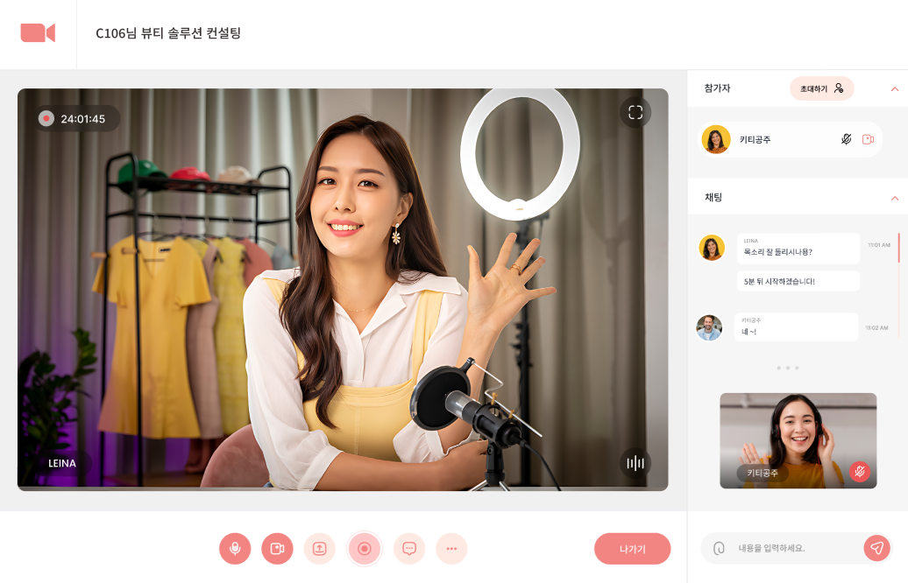

- **컨설팅 최종 결과 보고서 (1차 결과 + 2차 결과 + 3차 전문가 솔루션 )**

- 참고 : 유튜브 셜록뷰티

[https://www.youtube.com/@slb](https://www.youtube.com/@slbt)
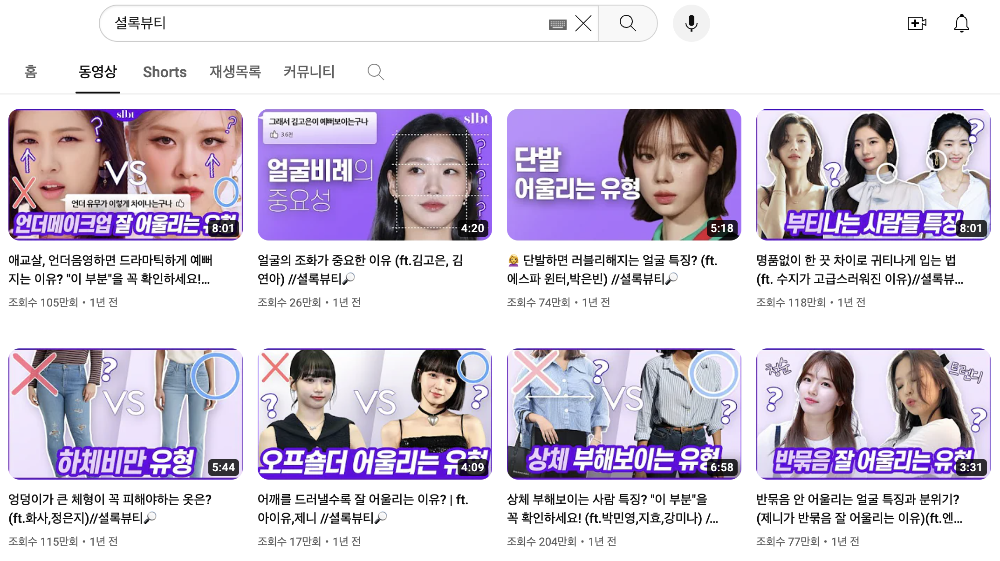

- 참고 : 유튜브 제이나, 뷰드름 유튜버 인씨

1) 유튜브 제이나

https://www.youtube.com/@Jaina0/videos
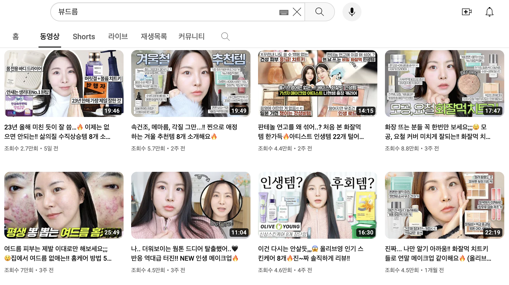

2) 뷰드름 유튜버 인씨

https://www.youtube.com/@beautyacne_inssi/videos

### 2. 뷰티 화상 커뮤니티

- 나만의 뷰티 팁이나 피부 관련 고민을 나눌 수 있는 화상 커뮤니티
- 컨설팅에 참여하지 않더라도 커뮤니티를 통해 꿀팁을 공유받을 수 있음

  ex) ‘한달만에 여드름 박멸한 나만의 꿀팁’ 이라는 주제로 화상 채팅방을 사전에 예약 개설하면 해당 시간에 듣고 싶은 사람들이 그룹 화상 미팅에 참여

- 익명 가능
- 유료아닌 무료
- 정보 공유 목적

### 3. 컨텐츠 (공지사항,매거진)
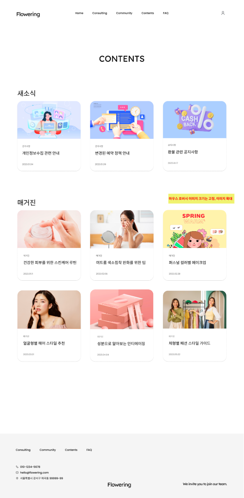

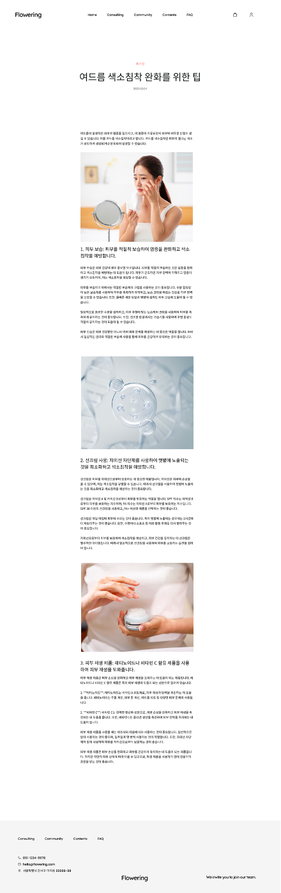

### -) 화장품 펀딩 / 화장품 개발

- 화상 미팅으로 다함께 제품 피드백을 하며 화장품 개발하기
- 개발 참가자는 사전 모집
- 개발 과정을 지켜보며 펀딩 가능
- 참고 :

1) 코덕 크라우드 펀딩

https://naver.me/G4Lf07PO

2) 유저와 함께 개발한 화해 토너

https://hwahae.onelink.me/8Yb2/x7y2nir2

## 마케팅

1. 무료로 이용 가능한 퍼스널 컬러 진단으로 사람들 끌어오기

   → 추후 다양한 브랜드와 협업해서 렌즈 , 립제품 등 ai 필터 인식까지
   (렌즈면 오렌즈랑 협업해서 실제 오렌즈 제품을 ai가 인식해서 내 얼굴 눈동자에 필터 적용)

2. 경력단절 남성, 여성이나 육아휴직 여성 전문가 우선 순위 채용
3. 이벤트성으로 뷰티 유튜버 설록홈즈, 제이나, 인씨 등 유명 뷰티유튜버들이 컨설팅

## 수익 창출

1. (-)다양한 브랜드와의 협업 광고 수수료
2. 상담 컨설팅 비용 ( 컨설팅 시간별로 요금 다르게 할 것인지 )
3. (-)5회, 10회 등 색다른 이용권을 묶어서 구매 할 시 할인가

## 디자인

1. 전체적인 느낌 색감은 봄 느낌
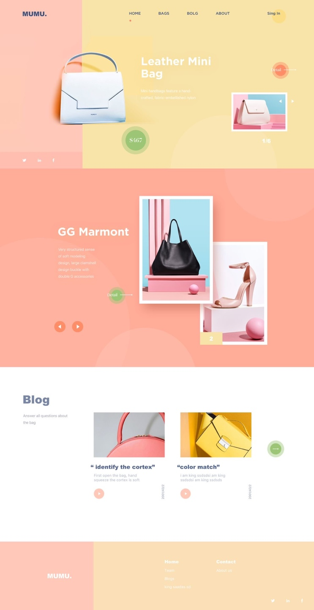
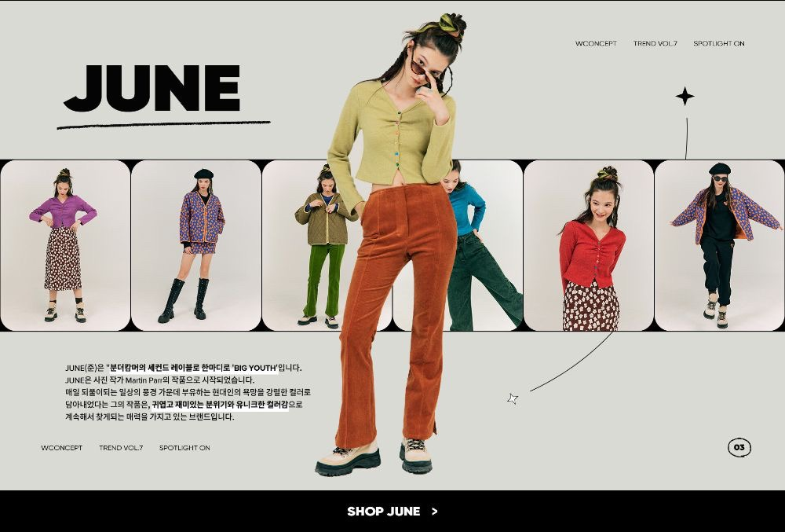

1. 한 사람이 스타일링에 따라 다르게 변하는 모습

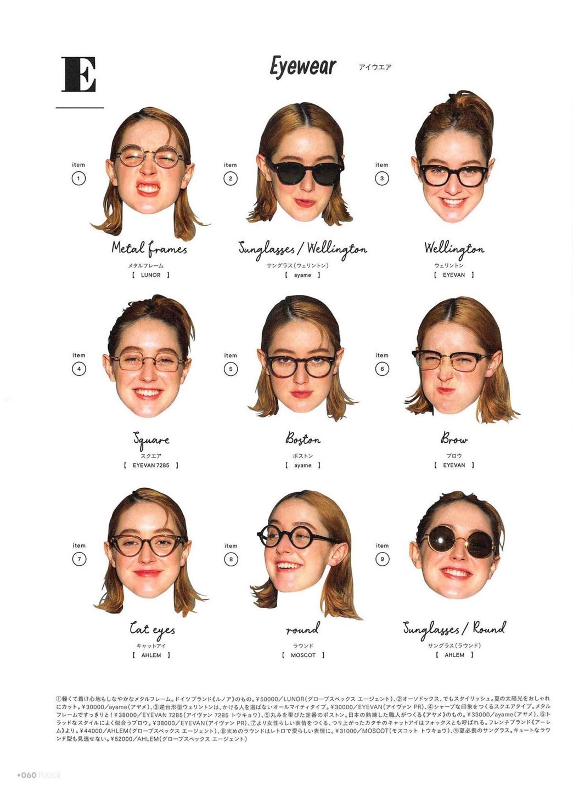

### # ERD

